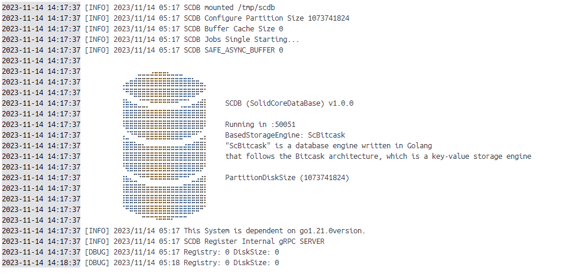

# SCDB
## _Solid Core Database System_

Solid Core Database is a basic key-value database engine that is true to the fundamentals, fast, and easy to access.

## Features

- `scdb` is a lightweight and fast key-value storage engine that stands out for its simplicity and speed. It's modeled after the Bitcask storage architecture, renowned for its efficiency in write operations.

- The core design principle behind `scdb` (and Bitcask) is influenced by log-structured filesystems. In this approach, all changes are appended to the end of a log, making writes exceptionally fast because they're sequential. This design is not only quick but also ensures the integrity of your data: even in the event of a system crash, you can recover the data easily thanks to this append-only method.

- Additionally, `scdb` incorporates a process known as log file merging. Over time, as your application writes more data, the number of log files will naturally increase. Log file merging is a technique that combines these files to prevent fragmentation and maintain performance. It's like housekeeping for your data, ensuring that your storage remains organized and efficient.

- So, if you're developing an application that requires speedy data writes and a simple yet robust storage solution, scdb might just be the engine you're looking for. It's built to give developers like you a hassle-free experience with the storage and retrieval of key-value pairs.

[!architecture](https://www.google.com/url?sa=i&url=https%3A%2F%2Ftech-lessons.in%2Fblog%2Fbitcask%2F&psig=AOvVaw0aTP9kzzTUGMLdEX0UPJv_&ust=1700037670564000&source=images&cd=vfe&opi=89978449&ved=0CBEQjRxqFwoTCLjp-4CMw4IDFQAAAAAdAAAAABAD)

## SDK versions

|Scdb version| Recommended Go SDK version |
|:-----:|:-----:|
| 1.0.0-alpha | 1.0.0-alpha |


### Install Scdb Go SDK
(**We plan to create an SDK repository for SCDB in the future.**)
1. Use `go get` to install the latest version of the Scdb Client and dependencies:

   ```shell
   go get -u github.com/sjy-dv/scdb/scdb/pkg/scdbclient/v1beta@v1.0.0-alpha
   ```

2. Include the Scdb in your application:

   ```go
   package main

    import (
	    "context"
	    "log"

	    scdbclient "github.com/sjy-dv/scdb/scdb/pkg/scdbclient/v1beta"
    )

    func main() {
	    conn, err := scdbclient.NewScdbConn("127.0.0.1:50051")
	    if err != nil {
		    log.Fatal(err)
	    }
	    defer conn.Close()
	    err = conn.Ping(context.Background())
	    if err != nil {
		    log.Fatal(err)
	    }
    	err = conn.Save(context.Background(), []byte("greeting"), []byte("helloworld"))
    	if err != nil {
	    	log.Fatal(err)
	    }
	    val, err := conn.Get(context.Background(), []byte("greeting"))
	    if err != nil {
		    log.Fatal(err)
	    }
	    log.Println(string(val))
	    err = conn.Del(context.Background(), []byte("greeting"))
	    if err != nil {
		    log.Fatal(err)
	    }
    }
   ```

## Docker

```sh
docker pull skj2414e954/scdb:1.0.0-alpha
docker run -d -p 50051:50051 skj2414e954/scdb:1.0.0-alpha
```

